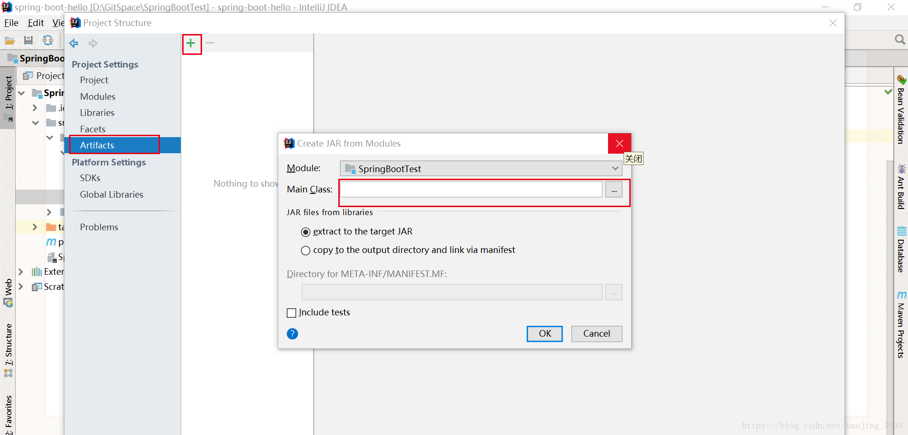
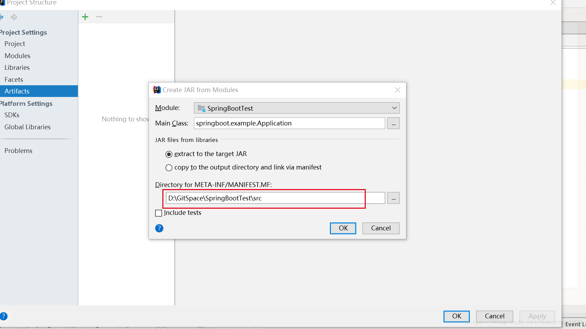

## ecust-healthdaily-java

> Selenium-Java 实现

仅供学习交流使用，作者对产生的一切后果概不负责。

## 关于打jar包找不到主类清单问题的解决方法：
> 注意：META-IFA 文件夹的路径为 /src 而非 /src/main/java

* 解决方法：
  1. 在生成jar包时，指定主类
  
  2. 更改默认的 META-IFA 文件夹路径
  
